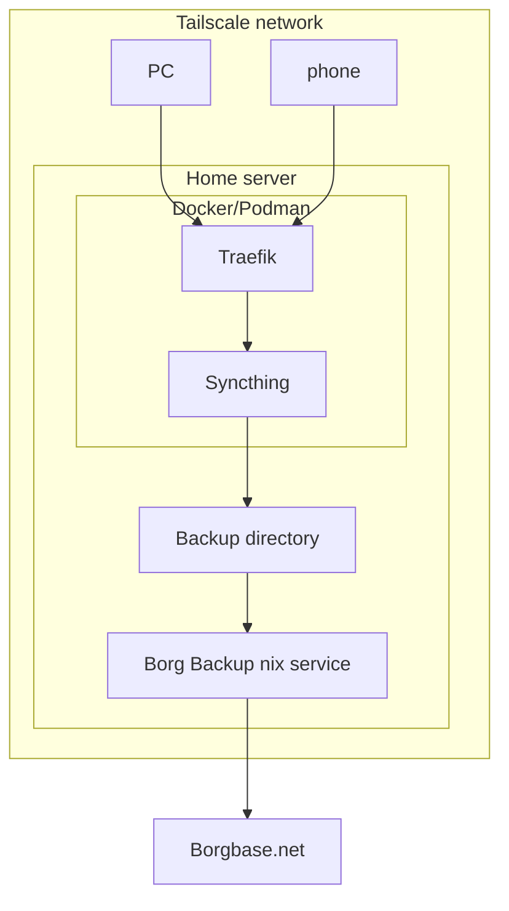

# Backups from portable devices

in addition to backing up regularly to Borgbase with the nix service, the ZFS dataset that contains the backup directory can use sanoid to snapshot regularly for local retention.

