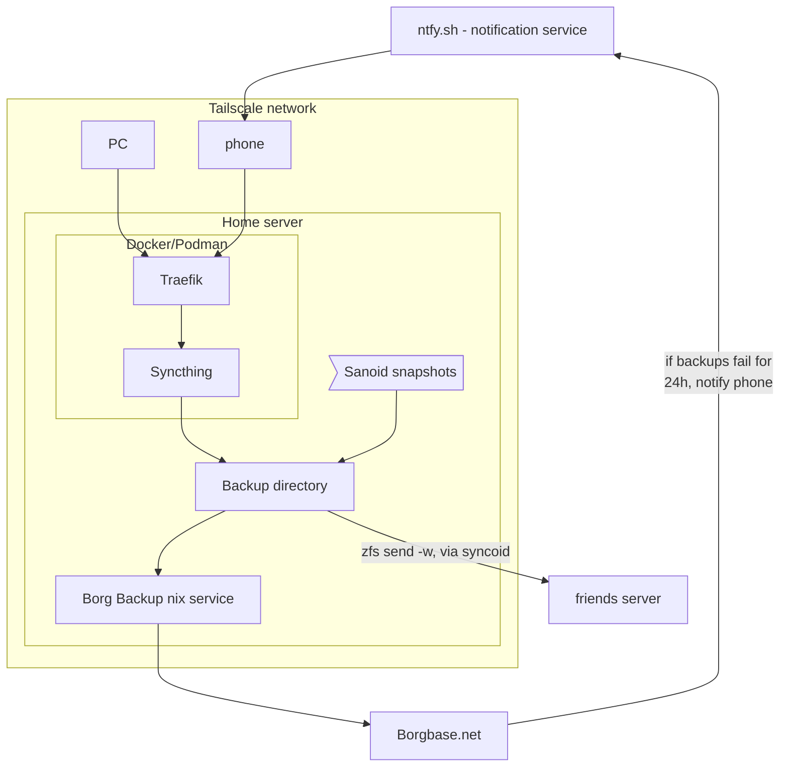

# tl-dr.no
---

# Introduction
These notes should not be to long, so i actually read them.

The current plan is to orgainze destinct projects or topics in their own "chapters" (since this tool is ment to create books).
And sub-chapters for smaller parts, like a pice of the project, or an attempt at a solution, that did not work out.

My current focus are backups, and this is my current ide for architecture:

| ℹ️ | zfs send, and sanoid are a work in progress |
|----|---------------------------------------------|

in addition to backing up regularly to Borgbase with the nix service, the ZFS dataset that contains the backup directory can use sanoid to snapshot regularly for local retention.
